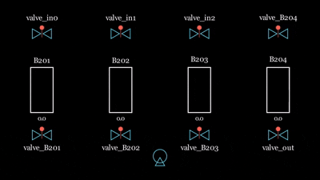
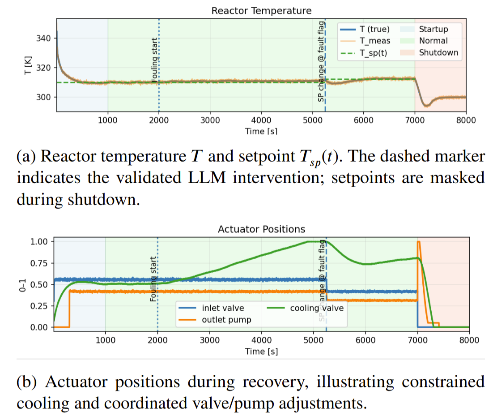

# ctrl-alt-recover

**From detection to action: LLM agents for fault-tolerant control**

`ctrl-alt-recover` is a research codebase for studying how Large Language Model
(LLM) agents can support supervisory fault recovery in cyber-physical systems.
The agents do not directly drive low-level controllers. They propose high-level
recovery decisions, which are checked against plant knowledge and digital-twin
rollouts before being accepted.

The repository contains two case studies:

- **Mixing Module**: a discrete supervisory-control problem where recovery is a
  valid state-machine path plus actuator configuration.
- **CSTR**: a continuous stirred-tank reactor under PID control where recovery is
  a validated setpoint adaptation.

## Repository Layout

```text
assets/                         Figures and animations used in the README
case_studies/
  mixer_case/
    mixer_case.py                Discrete LLM supervisory loop
    graph_retrieval_code.py      SPARQL retrieval for mixer KG context
  cstr_case/
    cstr_case.py                 Continuous CSTR LLM recovery loop
    cstr_digital_twin.py         CSTR simulation model
    cstr_anomaly_threshold_test.py
                                  Online threshold detector
knowledge_graphs/
  mixer_case/                    Mixer RDF/JSON-LD knowledge graphs
  cstr_case/                     CSTR RDF/JSON-LD knowledge graphs
results/                         Example experiment outputs
README.md
LICENSE
```

## Core Idea

Each experiment runs a closed-loop recovery process:

1. Initialize a digital twin of the plant.
2. Inject a configured fault or run in nominal mode.
3. Monitor the process state for violations or anomalies.
4. Ask an LLM agent for a supervisory recovery decision.
5. Ground the decision with knowledge graph context retrieved through SPARQL.
6. Validate the proposed action through simulation.
7. Apply the action if it is feasible and safe.
8. Reprompt the agent with failure feedback if validation fails.
9. Write decision traces and aggregate metrics to `results/`.

The important design choice is that the LLM is treated as a constrained
supervisory planner, not as an unchecked controller.

## Case Studies

### Discrete Mixing Module

The mixer case represents the plant as a finite state machine. The planning
agent chooses the next UML state, and the action agent maps that target state to
actuator commands.

Typical faults include:

- `pump_failure`
- `pump_degradation`
- `clogging_fault`
- `sensor_fault`
- `leak`
- `normal`

Recovery is evaluated using expected state sequences, path selection
(`normal` vs `bypass`), actuator correctness, physical feasibility, reprompt
counts, latency, and token use.



### Continuous CSTR

The CSTR case uses a nonlinear digital twin with PID loops. The LLM proposes
only three setpoints:

- `T_sp`: temperature setpoint in K
- `L_sp`: reactor level setpoint in L
- `Fin_sp`: inlet flow setpoint in L/s

Typical faults include:

- `fouling`
- `pump_degrade`
- `cool_stuck_closed`

The proposed setpoints are rolled out in the digital twin before being applied.
The validator checks actuator validity, unsafe exposure, time to safe state,
temperature limits, level limits, and persistence of recovery.



## Knowledge Graph Grounding

Both case studies use Graph Retrieval-Augmented Generation (Graph RAG). The
SPARQL retrieval code builds Turtle snippets that are appended to the prompts.

For the mixer, the retrieved graph includes:

- reachable UML states,
- state-machine transitions,
- transition guards and comments,
- state actions,
- actuator mappings.

For the CSTR, the retrieved graph includes:

- process operators,
- inputs and outputs,
- PID controller relationships,
- observable and actuatable parameters,
- setpoint reference values,
- module/component assignments.

GraphDB is expected at:

```text
http://localhost:7200/repositories/MixingModuleExample
```

Update `ENDPOINT` in the relevant `graph_retrieval_code.py` file if your
repository name differs.

## Setup

Requirements:

- Python 3.10+
- GraphDB with the supplied knowledge graphs imported
- An OpenAI-compatible API key for GPT models, or Ollama for local models
- The external `mixer_module` package available on the Python path for the
  mixer case

Create a `.env` file or export the key in your shell:

```bash
OPENAI_API_KEY=your_api_key_here
```

Install the Python packages used by the scripts. The project does not currently
ship a locked dependency file, but the scripts import packages such as:

```bash
pip install langgraph langchain-openai langchain-ollama python-dotenv pandas numpy matplotlib pydantic requests
```

## Running Experiments

Run commands from the case-study directory so local imports resolve cleanly.

Mixer examples:

```bash
cd case_studies/mixer_case
python mixer_case.py --fault pump_failure --runs 1 --model gpt-4o-mini --prompt-level normal
python mixer_case.py --fault all --runs 3 --model gpt-4.1-mini --prompt-level minimal
python mixer_case.py --fault leak --runs 10 --output ../../results
```

CSTR examples:

```bash
cd case_studies/cstr_case
python cstr_case.py --fault fouling --runs 1 --llm-model gpt-4o-mini --mode 3sigma
python cstr_case.py --fault all --runs 3 --llm-model gpt-4o-mini --output ../../results
python cstr_case.py --fault cool_stuck_closed --runs 1 --plot
```

For Ollama models, make sure the local server is running and pass the model name
with the relevant argument. Avoid model names containing `:` when creating CSV
filenames unless you also adjust the filename sanitisation.

## Decision Traces

The project records decision traces so that an experiment can be inspected after
the run instead of relying only on a success/failure label.

### Mixer Decision Trace

Mixer ablations write a per-run CSV, a summary CSV, and an iteration-level CSV.
The iteration CSV is the main trace artifact.

Typical fields include:

| Field | Meaning |
| --- | --- |
| `fault` | Fault scenario for the run |
| `run` | Run index |
| `iteration` | Supervisory-loop iteration |
| `planning_curr_state` | State observed before planning |
| `planning_chosen_state` | State selected by the planning agent |
| `planning_expected_state` | Expected next state from evaluator logic |
| `planning_correct` | Whether the chosen state matched expectation |
| `planning_reasoning` | Agent's stated reason for the transition |
| `action_target_state` | State passed to the action agent |
| `action_raw_output` | Raw actuator proposal |
| `action_reasoning` | Agent's stated actuator reasoning |
| `soll_*` | Expected actuator values |
| `ist_*` | Applied actuator values |
| `actuators_accuracy` | Per-iteration actuator accuracy |
| `was_reprompted` | Whether this decision needed correction |
| `reprompt_reason` | Validation or feasibility failure reason |
| `planning_input_tokens` | Planning prompt token count |
| `planning_output_tokens` | Planning response token count |
| `action_input_tokens` | Action prompt token count |
| `action_output_tokens` | Action response token count |

Example trace row:

```csv
fault,run,iteration,planning_curr_state,planning_chosen_state,planning_expected_state,planning_correct,action_target_state,action_raw_output,was_reprompted,reprompt_reason
pump_failure,0,4,state_filling_tank_B203,state_bypass_emptying_tank_b201,state_bypass_emptying_tank_b201,1,state_bypass_emptying_tank_b201,"pump_P102=1,valve_out_B201=1",0,
```

### CSTR Decision Trace

CSTR runs write per-run CSV files and an analysis JSON file. The JSON keeps the
latest evaluation context and is useful for inspecting why a setpoint proposal
passed or failed.

Typical fields include:

| Field | Meaning |
| --- | --- |
| `fault` | Fault scenario |
| `run` | Run index |
| `llm_model` | Model used for setpoint proposal |
| `success` | Whether a validated setpoint action was applied without exhausting reprompts |
| `eval_pass` | Whether the digital-twin rollout accepted the proposed setpoints |
| `final_control_zone` | Final control safety classification |
| `reprompts` | Number of corrective prompt attempts |
| `unsafe_seconds` | Approximate unsafe exposure in the logged simulation |
| `final_T_sp` | Final temperature setpoint |
| `final_L_sp` | Final level setpoint |
| `final_Fin_sp` | Final inlet-flow setpoint |
| `rollout_time_to_safe` | Time needed to regain safe operation in validation |
| `rollout_peak_T_meas` | Peak measured temperature in validation |
| `action_total_tokens_sum` | Total action-agent tokens |

Example analysis fragment:

```json
{
  "fault": "fouling",
  "run": 0,
  "analysis": {
    "final_setpoints": {
      "T_sp": 310.0,
      "L_sp": 10.0,
      "Fin_sp": 0.025
    },
    "last_eval_summary": "rollout reached safe operation within the validation window",
    "final_control_zone": "SAFE"
  }
}
```

## Prompt Examples

The actual scripts use structured output models. These examples show the shape
of the prompts and expected responses without requiring the full retrieved KG
snippet.

### Mixer Planning Agent

System intent:

```text
You are a planning agent responsible for deciding which state the system should
transition to next. Use the UML state machine, transition guards, transition
comments, current tank levels, and fault condition. Only output valid UML:State
instances from the knowledge graph.
```

User prompt example:

```text
CURRENT SITUATION:
- Current State: state_filling_tank_B203
- Fault Condition: pump_P101_failure

Tank status:
- B201: full
- B202: full
- B203: full
- B204: empty

TASK: Determine the next state to transition to.

Think step by step:
1. What phase am I in?
2. Is the current state's exit condition met?
3. If the exit condition is met, transition to the next state in the sequence.
4. If the exit condition is not met, stay in the current state.

Return JSON with: current_state, next_state, reasoning
```

Expected structured response:

```json
{
  "current_state": "state_filling_tank_B203",
  "next_state": "state_bypass_emptying_tank_b201",
  "reasoning": "B203 is full, so filling is complete. The fault affects the main P101 path, so the bypass emptying path should be selected."
}
```

### Mixer Action Agent

System intent:

```text
You are an action agent responsible for finding which actuators need to be
active in the target state. Use only actuators connected through
UML:State -> UML:doAction -> UML:Action -> CPSMod:isChangedByActuator.
```

User prompt example:

```text
TARGET STATE: state_bypass_emptying_tank_b201
FAULT CONDITION: pump_P101_failure

Based on the state name and fault condition, what actuators must be set?

Return JSON with: target_state, actions, reasoning
```

Expected structured response:

```json
{
  "target_state": "state_bypass_emptying_tank_b201",
  "actions": [
    { "actuator": "valve_out_B201", "value": 1 },
    { "actuator": "bypass_pump_P102", "value": 1 }
  ],
  "reasoning": "The target state is a bypass emptying state for B201, so the B201 outlet valve and bypass pump are active."
}
```

### CSTR Setpoint Action Agent

System intent:

```text
You are the Corrective Setpoint Action Agent for a CSTR. Propose only T_sp,
L_sp, and Fin_sp. Use KG relationships such as PO7_TempPID, PO8_FlowPID, and
PO6_LevelPID. If cooling is saturated and temperature is high, reduce load
before trying to cool harder.
```

User prompt example:

```text
CURRENT SNAPSHOT:
- time: 4210.0
- phase: 2
- T_meas: 313.4
- L_meas: 10.1
- u_valve: 0.82
- u_pump: 0.55
- u_cool: 0.99
- anomaly_ratio: 0.8
- violated_params: T_meas_error>2.0
- control_zone: UNSAFE
- control_reasons: saturated=['u_cool']; T_not_close_to_310
- current setpoints: T_sp=310.0, L_sp=10.0, Fin_sp=0.0333333333

EVALUATION FEEDBACK:
Previous rollout exceeded the unsafe fraction limit.

IMPORTANT RULES:
1. If evaluation failed previously, propose different setpoints.
2. Goal: reach SAFE and hold SAFE for at least 60 seconds.
3. If an actuator is near saturation, temperature must stay close to 310 K.
4. Setpoints can only change in increments of 0.05 for T_sp and L_sp, and 0.005 for Fin_sp.

Return ONLY JSON.
```

Expected structured response:

```json
{
  "T_sp": 310.0,
  "L_sp": 10.0,
  "Fin_sp": 0.025,
  "reasoning": "PO7 shows cooling is already saturated, so more cooling authority is unavailable. PO8 links Fin_sp to inlet flow, so reducing Fin_sp lowers heat/load while keeping the temperature target near 310 K."
}
```

## Safety and Validation Notes

- The LLM output is parsed into typed Pydantic models.
- Mixer states are checked against a valid-state list before use.
- Mixer actuator names are normalised before being applied.
- CSTR setpoints are rolled out on a cloned digital twin before application.
- Failed simulation, invalid actuator choices, unsafe rollouts, or repeated bad
  proposals trigger reprompting with feedback.
- Reprompt limits prevent infinite correction loops.

## Outputs

Results are written under `results/` by default. Common output names include:

```text
ablation_<model>_<prompt_level>_<timestamp>_runs.csv
ablation_<model>_<prompt_level>_<timestamp>_iterations.csv
ablation_<model>_<prompt_level>_<timestamp>_summary.csv
cstr_ablation_<model>_<mode>_<timestamp>_runs.csv
cstr_ablation_<model>_<mode>_<timestamp>_summary.csv
cstr_ablation_<model>_<mode>_<timestamp>_analysis.json
```

These files support both aggregate reporting and trace-level debugging.

## Citation / Research Use

This repository is intended as an executable research artifact for investigating
LLM-assisted supervisory recovery. When reporting results, include the model,
prompt level or detector mode, fault set, number of runs, GraphDB configuration,
and whether the run used OpenAI or Ollama-backed models.
